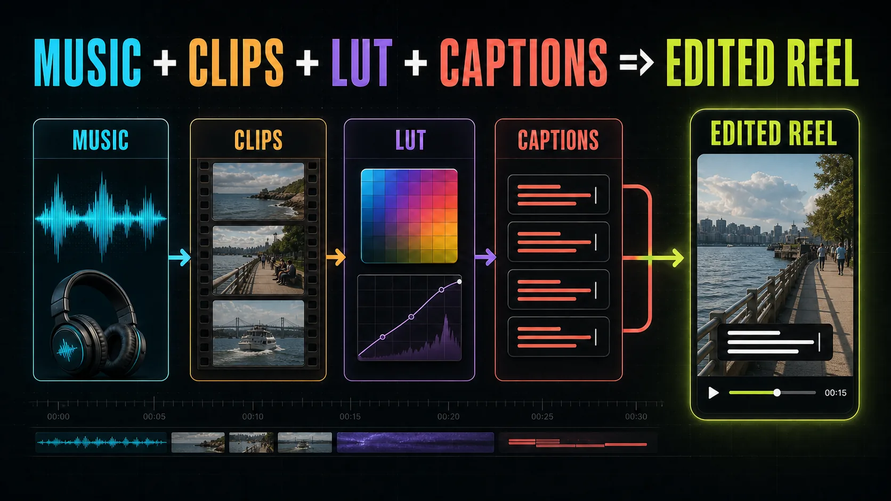

# Social Reel Engine

A local macOS workflow for turning supplied MP4/MOV footage into cinematic 9:16 social reels or ordered 1.91:1 landscape video carousel packages with Codex, FFmpeg, Remotion, and librosa. Originals remain unchanged. Every generated artifact is checksum-bound, color transforms are explicit, and final exports require current edit, color, and user-confirmed asset-rights records.

## Pipeline at a glance



## Start a reel in a new Codex task

Open this folder as the workspace, attach or provide paths to your clips/music/captions, then ask:

> Use $create-social-reel to create a 20–30 second cinematic vertical reel from the clips, music, captions, and LUTs I provide.

The skill creates `projects/<reel-name>`, ingests local copies of the supplied files, analyzes them, and pauses at the two visual checkpoints. It never chooses an unconfirmed technical transform. Per-shot stabilization is baked into the rough preview, so the approved framing is the framing used downstream.

To request an optional shareable-stills package after the approved reel, add this to the prompt:

> After final master and delivery QC, export the five best clean photo stills in 9:16 and 4:5. Reuse the approved framing for 9:16, and present proposed reframes for 4:5 before final export.

The reel remains a 9:16 vertical video. Photo packages support `9:16`, `4:5`, `1:1`, and `16:9`; they reuse the approved moving crop as their anchor rather than changing the reel edit.

For independently shareable landscape video cards, create the job as a carousel:

```bash
npm run reel -- new loboc-river --title "Loboc River" --format carousel-1.91:1
```

Each ordered edit clip becomes one 1910×1000 MP4 card and must last 4–5 seconds. The combined rough preview is used to approve order, trim, and composition; the final `render-carousel` command publishes separate files and `qc-carousel` verifies every card.

## One-time local setup

```bash
nvm use
npm ci
python3 -m venv .venv
.venv/bin/python -m pip install -r requirements.txt
npx remotion browser ensure
npm run reel -- doctor
```

Pinned runtime:

- Node.js 24.12.0 and npm 11.6.2
- Remotion packages 4.0.507
- Python 3.11 virtual environment with librosa 0.11.0
- Local FFmpeg/ffprobe with LUT, zscale, stabilization, H.264, ProRes, AAC, and loudness support

## Workflow and checkpoints

```text
new → ingest → analyze → proxy → beats → rough edit → validate → preview
                                                         ↓
                                                approve-edit (pause 1)
                                                         ↓
                                  grade-stills → approve-color (pause 2)
                                                         ↓
                              confirm-rights → grade → render → master QC → delivery QC
                                                                            ↓
                                           optional: photos (9:16 exports automatically)
                                                                            ↓
                                     optional non-9:16 contact sheet → approve-photos → export
```

Typical commands:

```bash
npm run reel -- new island-sunrise --title "Island Sunrise"
npm run reel -- ingest island-sunrise /path/to/clip-1.mp4 /path/to/clip-2.mov --kind clips
npm run reel -- ingest island-sunrise /path/to/music.wav --kind music
npm run reel -- ingest island-sunrise --library dji-mini-4-pro-dlogm-rec709-v1
npm run reel -- style --list
npm run reel -- style island-sunrise --apply philippines-island-editorial
npm run reel -- analyze island-sunrise
npm run reel -- proxy island-sunrise
npm run reel -- beats island-sunrise
npm run reel -- validate-edit island-sunrise
npm run reel -- preview island-sunrise
npm run reel -- approve-edit island-sunrise
npm run reel -- grade-stills island-sunrise
npm run reel -- approve-color island-sunrise
npm run reel -- confirm-rights island-sunrise
npm run reel -- grade island-sunrise
npm run reel -- render island-sunrise
npm run reel -- qc island-sunrise --target master
npm run reel -- qc island-sunrise --target delivery
npm run reel -- photos island-sunrise --aspect 9:16 4:5 --count 5
# Review previews/photo-candidates/4x5/contact-sheet.jpg, then after explicit approval:
npm run reel -- approve-photos island-sunrise
npm run reel -- photos island-sunrise
npm run reel -- status island-sunrise
```

Carousel finalization uses the same ingest, preview, edit approval, graded-still, color approval, rights, and grade commands, followed by:

```bash
npm run reel -- render-carousel loboc-river
npm run reel -- qc-carousel loboc-river
npm run reel -- status loboc-river
```

Use `npm run reel -- ingest <name> --list-library` to inspect the local LUT catalog. Catalog installation copies the LUT into the job, verifies its SHA-256 checksum, and writes its declared semantics into `config/luts.json`.

Use `npm run reel -- style --list` to inspect reusable typography and palette presets. Applying a preset downloads only its required Google Fonts from commit-pinned URLs, verifies their SHA-256 checksums, caches them locally under `library/fonts/`, ingests exact project copies, and writes `config/style.json`. Run `analyze` afterward. The included fonts use OFL-1.1; selected font checksums participate in rights and render identity. Typography changes require a new rough review, but they do not invalidate an otherwise exact color approval. Presets never alter exposure, white balance, tint, contrast, or LUT choices, and the optional Tagalog-script font never authorizes generated or inferred Baybayin copy.

Run `confirm-rights` only after the user explicitly confirms the exact current used asset set. The command records that decision and its asset-checksum fingerprint in `brief.json`; `status` blocks final export if a referenced asset later changes, without invalidating confirmation for unused inputs.

## Color safety

The enforced order is:

```text
shot exposure/white balance/tint
→ exact technical normalization LUT
→ optional creative LUT at an approved blend
→ Rec.709 output
```

A combined technical/creative LUT replaces the technical and creative stages; it is never stacked with a second normalizer. Grading and final export stop when camera model, canonical input gamma, canonical input gamut, profile ID, LUT metadata, file checksum, or transform semantics are missing or mismatched. A rough-cut proxy may still be made, but it is visibly marked as an unnormalized log preview.

The supplied local library contains:

- DJI Mini 4 Pro D-Log M → Rec.709 technical transform
- Sony S-Log3/S-Gamut3.Cine → Rec.709 technical transform
- Sony S-Log3/S-Gamut3 → Rec.709 technical transform
- 18 Szatrasie creative looks, applied after normalization with a default 50% blend
- `HDR CONVERSION LUT.cube`, intentionally blocked until its input/output spaces and semantics are confirmed

The supplied Szatrasie guide recommends tuning creative LUT intensity per shot, generally within 20–80%, and does not prescribe a fixed look by scene. The workflow therefore compares reference frames and asks for approval.

## Job structure

```text
projects/<reel-name>/
├── brief.json
├── input/
│   ├── clips/
│   ├── music/
│   ├── captions/
│   ├── luts/{technical,creative}/
│   ├── fonts/
│   └── brand/
├── config/
│   ├── settings.json
│   ├── sources.json
│   ├── luts.json
│   ├── style.json
│   └── photos.json
├── analysis/
├── edits/edit.json
├── work/
├── previews/
└── output/
```

Every runtime `projects/<reel-name>` job is local-only and ignored by Git, including media, metadata, edit manifests, approvals, analysis, previews, QC reports, and renders. Only `projects/.gitkeep` is tracked; reusable scaffold changes belong in `templates/reel/`.

## Output contracts

- Preview: 540×960, 30 fps, H.264/yuv420p, AAC, BT.709
- Master: 1080×1920, 30 fps, ProRes 422 HQ, 10-bit 4:2:2, PCM-16/48 kHz, PNG source frames, BT.709
- Delivery: H.264/yuv420p CRF 17, AAC requested at 256 kbps, fast-start, BT.709, measured two-pass normalization to −14 LUFS and −1.5 dBTP; intentionally silent edits retain a valid AAC track without invalid loudness processing
- Carousel package: one independently encoded 1910×1000, 30 fps, H.264/yuv420p MP4 per ordered 4–5 second card, using the delivery audio, fast-start, color-tag, and loudness policy; `analysis/carousel.json` records order, paths, checksums, sizes, durations, and package freshness
- Carousel QC: consolidated JSON and Markdown reports under `analysis/qc-carousel.*`; a failure on any card blocks package completion
- Optional photo package: five clean, quality-95 JPEG stills per requested profile by default, tagged with the macOS sRGB profile; `9:16` uses the approved crop exactly, while `4:5`, `1:1`, and `16:9` require reframe review before publication

QC writes `analysis/qc-<target>.json` and `analysis/qc-<target>.md` with approval status, artifact freshness, missing media, duration, dimensions, frame rate, codec/profile, color tags, pixel format, audio codec/rate/observed average bitrate, MP4 fast-start placement, loudness, black sections, frozen sections, and readability. AAC average bitrate is content-dependent, so a positive value outside tolerance is surfaced as a warning while the requested encoder setting remains enforced by the render fingerprint.

Photo output is gated on current edit/color approvals, used-asset rights, graded intermediates, and passing current master and delivery QC reports that are bound to their exact render artifacts. Candidate contact sheets are written to `previews/photo-candidates/`; final files are atomically published as `output/photos/<profile>/01.jpg` through `05.jpg`. `analysis/photos.json` and `analysis/photo-qc.{json,md}` record the selections, crop, checksums, dimensions, and freshness evidence.

## Verification

```bash
npm run typecheck
npm run test
npm run test:e2e
npm run reel -- doctor
```

`npm run test:e2e` creates temporary synthetic media and exercises audible and intentionally silent two-clip reels. It uses non-zero video/music offsets, renders preview/master/delivery outputs, validates all three through QC, generates an automatic 9:16 photo package plus an approved 4:5 reframe package, and verifies that source checksums did not change.
